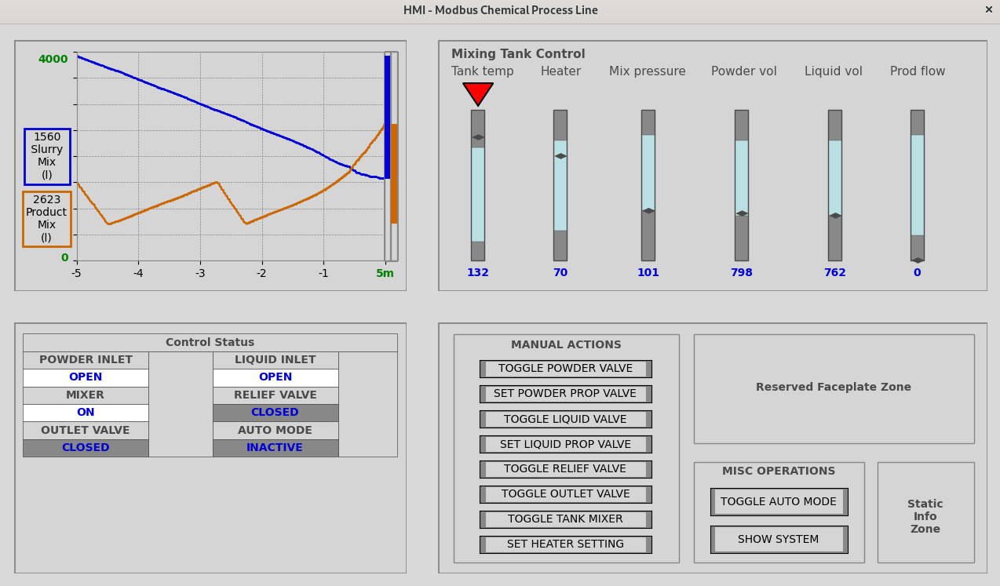
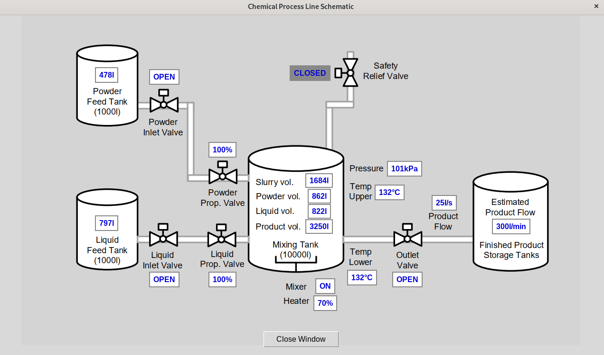

# HMI for Modbus TCP Operations

These files are meant to be used with the ModbusTCP server in `../Server/modbus_chemical_process.py`. The interface allows users to set parameters, toggle options, and view real-time statuses using an interface based on high performance HMI concepts.

Unlike the Modbus voltage regulator, this HMI uses Modbus operations `read multiple registers` and `read multiple coils` to update the HMI with the server values.

## Usage

To run the ModbusTCP server and HMI (acting as client) with default parameters, run these commands from HMI directory:
```shell
python3 ../Server/modbus_chemical_process.py.py&
python3 main.py
```

For advanced usage, the HMI script `main.py` accepts several command line arguments:

- `--host`: Host IP address or hostname to connect to. Defaults to `127.0.0.1`.
- `-u, --unit_id`: Set the Modbus "unit id". The value should be between 1 and 255, either in decimal or hexadecimal format. Defaults to 1.
- `-p, --port`: Set TCP port to connect to the Modbus server. The port number can be in the range 1 to 65535, either in decimal or hexadecimal format. Defaults to 11502.
- `-t, --timeout`: Set the connection timeout in seconds. The value should be a positive integer less than 120 seconds. Defaults to 5.

Example usage with command line arguments:
```shell
python3 main.py --host 192.168.1.100 -p 502 -u 1 -t 10
```

## Dependencies

- `matplotlib`: This library facilitates the creation of the graphical components and visualization for the interface.
- `Pillow`: Used for opening an image as an HMI background of the schematic overview

Install with:
```shell
pip install -r requirements.txt
```

## HMI Interface

HMI overview with control buttons, status bars and indicators:


Schematic overview with statuses:


