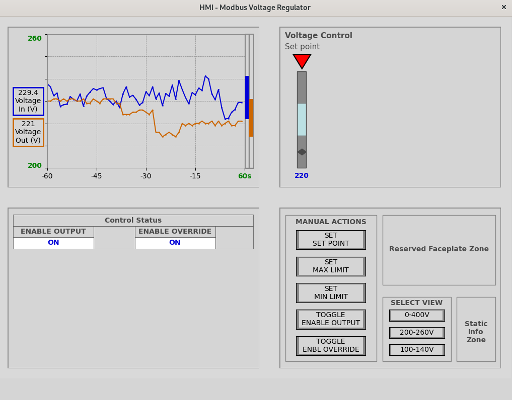

# HMI for Modbus TCP Operations

These files are meant to be used with the ModbusTCP server in `../Server/modbus_voltage_regulator.py`. The interface allows users to set parameters, toggle options, and view real-time statuses using an interface based on high performance HMI concepts.

## Usage

To run the ModbusTCP server and HMI (acting as client) with default parameters, run these commands from HMI directory:
```shell
python3 ../Server/modbus_voltage_regulator.py&
python3 main.py
```

For advanced usage, the HMI script `main.py` accepts several command line arguments:

- `--host`: Host IP address or hostname to connect to. Defaults to `127.0.0.1`.
- `-u, --unit_id`: Set the Modbus "unit id". The value should be between 1 and 255, either in decimal or hexadecimal format. Defaults to 1.
- `-p, --port`: Set TCP port to connect to the Modbus server. The port number can be in the range 1 to 65535, either in decimal or hexadecimal format. Defaults to 11502.
- `-t, --timeout`: Set the connection timeout in seconds. The value should be a positive integer less than 120 seconds. Defaults to 5.

Example usage with command line arguments:
```shell
python3 main.py --host 192.168.1.100 -p 502 -u 1 -t 10
```

## Dependencies

- `matplotlib`: This library facilitates the creation of the graphical components and visualization for the interface.
- `Pillow`: Used for opening an image as an HMI background of the schematic overview

Install with:
```shell
pip install -r requirements.txt
```

## HMI Interface

The HMI components:

- **Trend Graphs**: See historical values of the input and output voltage for the voltage regulator
- **Control Buttons**: For performing actions such as setting the set point, max limit, min limit, enabling output, and enabling overrides.
- **View Selection**: Options to switch between different voltage views.
- **Status Indicators**: Displays the status of the Modbus operations, enabling users to understand the current configuration and system state at a glance.



## GUI Details

- **Set Point Button**: Allows the user to update the set point for output voltage by entering a value within the range 0-1024.
- **Max/Min Limit Buttons**: Enables setting the maximum and minimum limits within the specified range.
- **Toggle Buttons**: For enabling/disabling the output and override options.
- **Voltage View Buttons**: Enables viewing voltage values in different ranges, such as 0-400V, 200-260V, and 100-140V.
